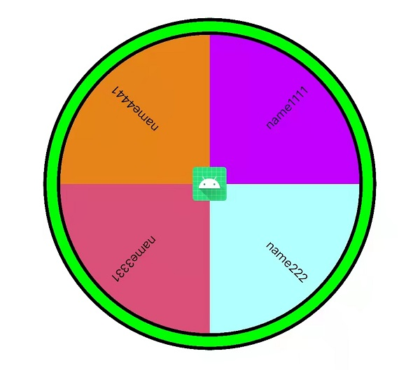
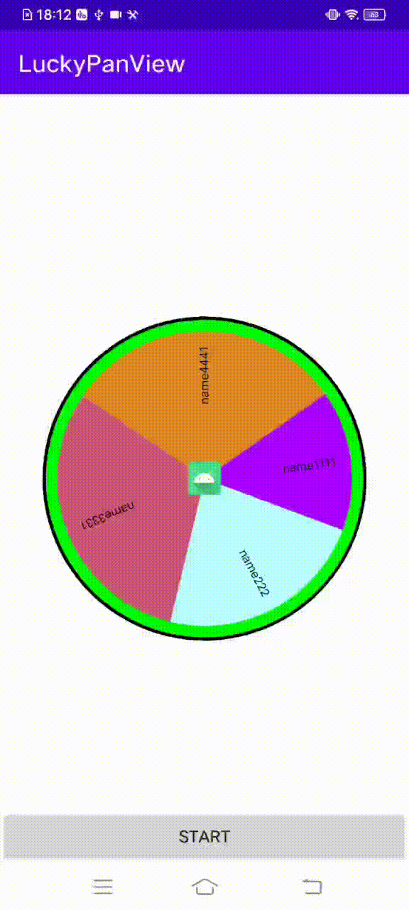

## 抽奖转盘自定义控件

### 中奖机率的算法
比如有选项：A(权重:1),B(权重:1),C(权重:3)
<br>
将所有权重累加得到1+1+3=5,则
<br>A分布:0-1
<br>B分布:1-2
<br>C分布:2-5
<br>然后计算一个0-5之间的随机数，由随机数所在分布范围得出中奖选项

### 支持特性如下:

| 属性 | 类型 |说明 |
|-------| ------- |------- |
|static_pan_style_pojo|reference|databinding属性，设置转盘样式颜色|
|static_pan_pojo|reference|databinding属性，设置转盘权重与盘片数据|
|static_pan_divider_color|int|设置转盘描边颜色,默认black|
|static_pan_divider_mode|enum|设置转盘描边模式，共3种,mode_none:无描边,mode_single:单条描边，mode_double:两条描边,此模式下描边之间的颜色由static_pan_style_pojo内edgeColor填充,默认mode_none|
|static_pan_divider_ratio|float|描边粗细占整个控件比例，范围0-1,默认0.01|
|static_pan_antialias|boolean|是否有抗锯齿,默认false|
|static_pan_draw_text_x_start_ratio|float|盘片内文字显示的起点位置占整个文字的比例，文字显示以圆心为起点，圆周为终点|
|static_pan_draw_text_x_end_ratio|float|盘片内文字显示的终点位置占整个文字的比例，文字显示以圆心为起点，圆周为终点|
|static_pan_pointer|reference|中间指针素材，注意起点是12点位置，所以指针也需要是指向12点位置的|
|static_pan_pointer_ratio|float|中间指针宽度所占控件宽度比例,范围0-1,默认0.15|
|static_pan_draw_text_color|int|文字颜色|
|static_pan_draw_text_size|dimension|文字大小|
|static_pan_draw_text_line|int|文字显示最大行数,根据实际文字数量与可显示区域宽度自动换行,默认1|
|static_pan_draw_split_line|boolean|每个盘片之间是否有分隔线,默认false|
|static_pan_draw_split_line_color|int|盘片分隔线颜色,默认white|
|static_pan_chainstyle|enum|盘片权重模式<br>spread:数量等分，按照盘片数量平均分布<br>spread_inside:权重分布，按照各个盘片的权重数值动态计算所占圆盘的比例|

## 项目依赖
[](https://jitpack.io/#Savion1162336040/luckypanview)
### Step 1. Add it in your root build.gradle at the end of repositories
```
allprojects {
	repositories {
		...
		maven { url 'https://jitpack.io' }
	}
}
```
### Step 2. Add the dependency
```
dependencies {
    implementation 'com.github.Savion1162336040:luckypanview:1.0'
}
```


